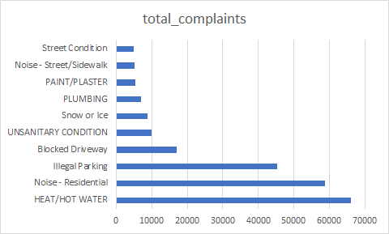
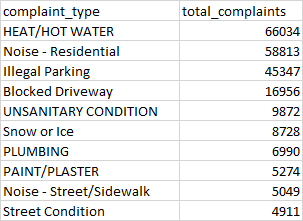
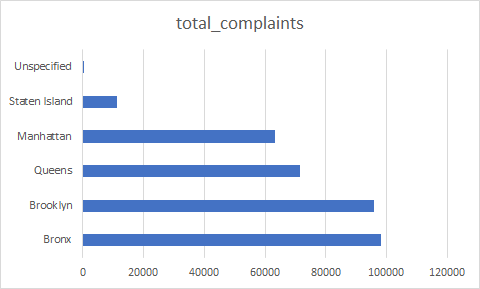
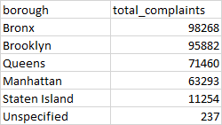

# Analysis Report (NYC 311)

## Overview
This report analyzes NYC 311 service request data to identify patterns in complaint volume, geographic distribution, and operational performance.

---

## 1. Complaint Volume by Type

### Query
(see sql/01_analysis_project_queries.sql)

### Chart

###Sample Output

### Insight
The dataset is dominated by a few high-volume complaint types, particularly **HEAT/HOT WATER**, **Noise - Residential**, and **Illegal Parking**.  
This suggests that a large portion of city service demand is concentrated in housing conditions and noise-related issues.

### Interpretation
These categories likely represent recurring, systemic urban issues rather than isolated incidents.

---

## 2. Complaint Distribution by Borough

### Query
(see SQL file)

### Chart

###Sample Output

### Insight
The Bronx and Brooklyn account for the largest share of complaints, each contributing a significant percentage of total requests.

### Interpretation
This indicates higher service demand in these boroughs, which may reflect population density, housing conditions, or reporting behavior.

---

## 3. Daily Complaint Trends

### Query
(see SQL file)

### Insight
Complaint volume fluctuates throughout the month, with noticeable peaks on certain days.

### Interpretation
This suggests short-term spikes in service demand, possibly driven by weather, weekends, or specific events.

---

## 4. Resolution Time by Complaint Type

### Query
(see SQL file)

### Insight
Certain complaint types such as **Tunnel Condition** and **Cannabis Retailer** have significantly higher average resolution times compared to others.

### Interpretation
These may involve more complex investigations, multiple agencies, or lower prioritization.

---

## 5. Unresolved Complaints Percentage

### Query
(see SQL file)

### Insight
Approximately **5% of complaints remain unresolved**.

### Interpretation
While most requests are completed, a small portion remains open, which could indicate backlog or ongoing cases.

---

## Key Takeaways

- Complaint volume is highly concentrated in a few categories  
- Service demand is uneven across boroughs  
- Resolution times vary significantly depending on complaint type  
- A small but notable percentage of requests remain unresolved  

---

## Conclusion

The NYC 311 dataset reveals clear patterns in urban service demand, highlighting areas where city resources are most needed.  
This analysis demonstrates how SQL can be used to transform raw operational data into actionable insights.
